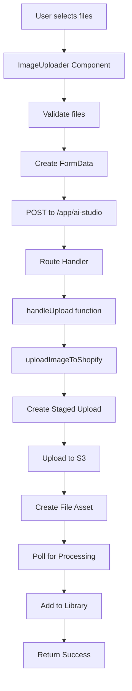

# Image Upload Testing Guide

## Overview

The AI Studio supports manual image uploads for products. This guide explains how to test the upload functionality and troubleshoot common issues.

## Upload Flow Architecture



## File Support

### Supported Formats
- **JPEG** (.jpg, .jpeg) - `image/jpeg`
- **PNG** (.png) - `image/png`
- **WebP** (.webp) - `image/webp`

### File Limits
- **Max file size**: 10MB per file
- **Max files per upload**: 5 files
- **Total library size**: Unlimited (stored in Shopify metafields)

## Test Files

Two test files are provided:
1. **Brown Hoodie** (`5aa62579-8b5a-4a38-b9ab-542b2c44ddd3 (1).jpg`)
   - Format: JPEG
   - Size: ~340KB
   - Type: Product image with D.FRANKLIN branding

2. **Portrait** (`maddie.webp`)
   - Format: WebP
   - Size: ~92KB
   - Type: Portrait with bob haircut

## Testing Steps

### 1. Verify Test Files Exist

```bash
# Run the validation script
node test-upload-manual.mjs
```

This script will:
- Check if test files exist
- Validate file formats
- Verify file sizes are within limits
- Show expected upload behavior

### 2. Start Development Server

```bash
npm run dev
```

Wait for:
- Shopify CLI to start
- Remix development server to start
- Tunnel URL to be established

### 3. Access AI Studio

1. Open the Shopify Admin
2. Navigate to your app
3. Go to AI Studio
4. Select product or use direct URL:
   ```
   https://admin.shopify.com/store/[your-store]/apps/dreamshot-model-swap/app/ai-studio?productId=gid%3A%2F%2Fshopify%2FProduct%2F14764565168459
   ```

### 4. Test Upload Flow

1. Click on **"Manual Upload"** tab
2. Either:
   - Drag and drop test files into the drop zone
   - Click "Add images" to open file selector
3. Verify files appear with thumbnails
4. Click **"Upload X images"** button
5. Monitor progress bar
6. Check for success message

### 5. Verify Upload Results

After successful upload:
1. Images should appear in the Library section
2. Images can be selected as source for AI generation
3. Images can be published to product
4. Check browser console for any errors

## Debugging

### Enable Debug Mode

To use the debug version of the uploader, temporarily modify `ImageGenerationHub.tsx`:

```tsx
// Replace this import
import { ImageUploader } from "./ImageUploader";
// With this
import { ImageUploader } from "./ImageUploader.debug";
```

The debug version provides:
- Detailed console logging
- On-screen debug log
- File validation details
- Upload progress tracking

### Common Issues and Solutions

#### Issue: "No file provided" error
**Cause**: FormData not properly constructed
**Solution**: Ensure files are properly appended to FormData with correct field names

#### Issue: "File too large" error
**Cause**: File exceeds 10MB limit
**Solution**: Use smaller test files or increase limit in `file-upload.server.ts`

#### Issue: "Invalid file type" error
**Cause**: File MIME type not in allowed list
**Solution**: Ensure file has correct MIME type and extension

#### Issue: Upload hangs or times out
**Cause**: Network issues or server processing delay
**Solution**:
1. Check server logs
2. Verify Shopify API credentials
3. Ensure proper authentication

#### Issue: Files don't appear in library
**Cause**: Metafield update failed
**Solution**:
1. Check GraphQL response for errors
2. Verify product ID is valid
3. Check metafield permissions

### Server-Side Debugging

Check server logs for detailed error messages:

```bash
# In the terminal running npm run dev
# Look for messages like:
[file-upload] Creating staged upload for: filename.jpg
[file-upload] Uploading to staged URL: filename.jpg
[file-upload] Creating file asset: filename.jpg
[file-upload] Polling for completion: gid://shopify/MediaImage/123
[file-upload] Upload complete: https://cdn.shopify.com/...
```

### Network Debugging

Use browser DevTools:
1. Open Network tab
2. Filter by "Fetch/XHR"
3. Look for POST request to `/app/ai-studio`
4. Check:
   - Request payload (FormData)
   - Response status code
   - Response body

Expected successful response:
```json
{
  "ok": true,
  "savedToLibrary": true
}
```

## API Endpoints

### Upload Endpoint
- **URL**: `/app/ai-studio`
- **Method**: POST
- **Content-Type**: multipart/form-data
- **Fields**:
  - `intent`: "upload"
  - `file`: File object
  - `productId`: Shopify product GID

### Response Format

Success:
```json
{
  "ok": true,
  "savedToLibrary": true
}
```

Error:
```json
{
  "ok": false,
  "error": "Error message here"
}
```

## Testing Scripts

### Manual Validation
```bash
node test-upload-manual.mjs
```
Validates test files and shows expected behavior.

### Endpoint Testing
```bash
node test-upload-endpoint.mjs
```
Makes actual HTTP requests to test the upload endpoint (requires server running).

### Unit Tests
```bash
npm test -- ImageUploader.test.tsx
```
Runs component unit tests.

### Integration Tests
```bash
npm test -- upload-integration.test.ts
```
Tests the complete upload flow.

## Environment Variables

Ensure these are set in `.env`:
```env
SHOPIFY_API_KEY=your_api_key
SHOPIFY_API_SECRET=your_api_secret
SHOPIFY_APP_URL=https://your-tunnel-url.ngrok.io
FAL_KEY=your_fal_api_key
```

## Troubleshooting Checklist

- [ ] Test files exist and are valid
- [ ] Development server is running
- [ ] Logged into Shopify Admin
- [ ] Product exists with given ID
- [ ] Environment variables are set
- [ ] No CORS errors in console
- [ ] Network requests complete successfully
- [ ] Server logs show no errors
- [ ] GraphQL mutations succeed
- [ ] Metafields update correctly

## Support

If uploads still fail after following this guide:
1. Check server logs for detailed errors
2. Review recent code changes in git
3. Test with different file types/sizes
4. Try a different product ID
5. Clear browser cache and cookies
6. Restart development server